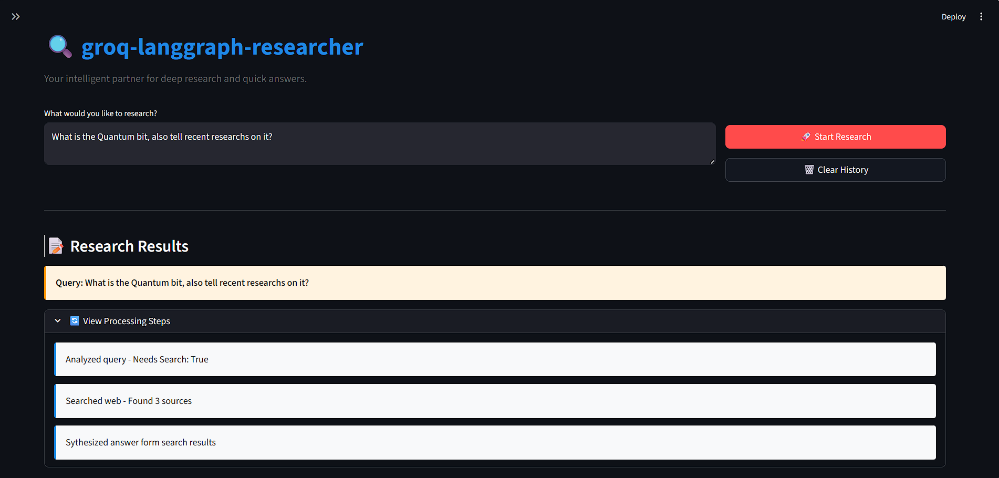

# 🔍 groq-langgraph-researcher


**groq-langgraph-researcher** is an intelligent agent designed to determine whether a user query requires real-time web search or can be answered using internal knowledge. Built using **LangGraph** for state management, **Groq** for ultra-fast inference, and **Tavily** for optimized search results.

## 🚀 Key Features

* **Intelligent Routing**: Automatically analyzes queries to decide if external web search is "SEARCH" or "DIRECT" knowledge.
* **Agentic Workflow**: Uses a graph-based architecture (LangGraph) to manage state, steps, and decision logic.
* **Real-Time Data**: Integrates Tavily Search API to fetch current events and specific data sources.
* **High-Speed Inference**: Powered by the **Llama-3.3-70b-versatile** model via Groq.
* **Interactive UI**: A clean Streamlit interface with step-by-step process visualization and session history.

  ## 📸 Screenshots

<div align="center">
  
  <p><em>The main research interface with intelligent query routing</em></p>
  
  <br>
  
  
  <p><em>Comprehensive research results generated with citations</em></p>
</div>


## 🛠️ Tech Stack

* **Frontend**: Streamlit
* **Orchestration**: LangGraph, LangChain
* **LLM Provider**: Groq (Llama 3.3 70B)
* **Search Tool**: Tavily AI
* **Environment Management**: Python Dotenv

## 📂 Project Structure

```bash
├── app.py              # Main Streamlit application and UI logic
├── graph_logic.py      # LangGraph workflow, nodes, and state definitions
├── requirements.txt    # Project dependencies
├── .env                # API keys (not committed)
└── README.md           # Project documentation
